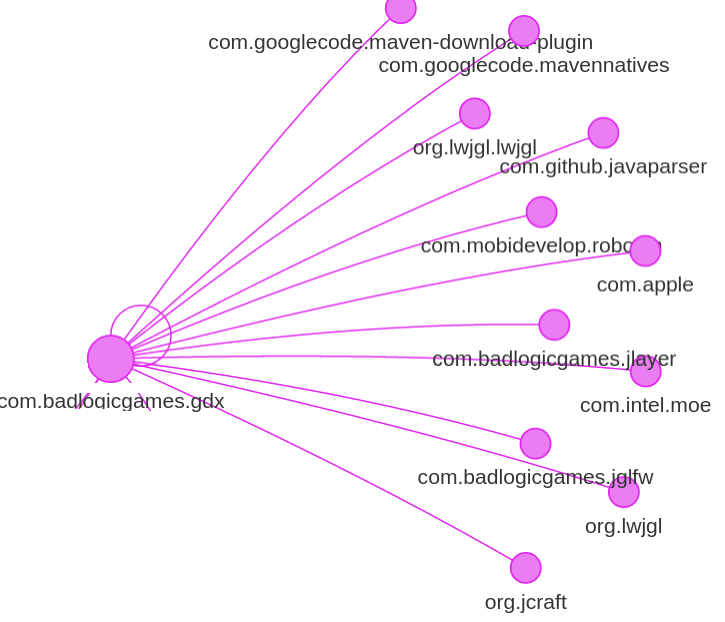
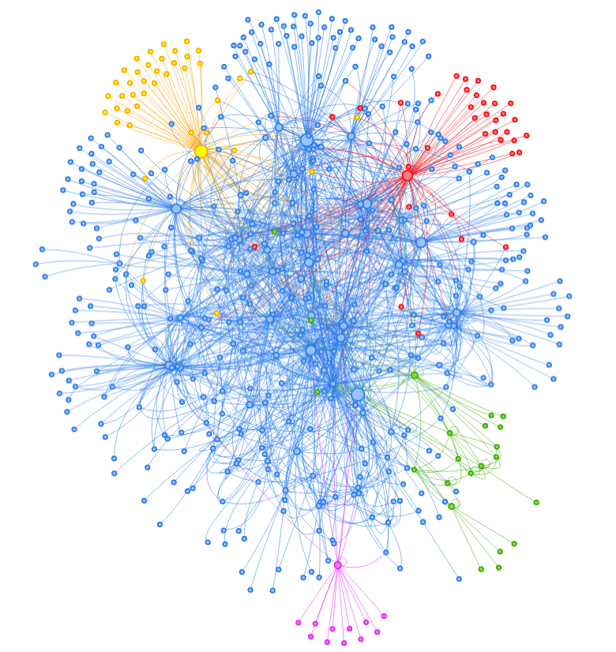

# Introduction

BIANCA reposes on the idea that real world softwares are not monolithic anymore. 
Indeed, softwares that perform task beyond sheer experiments have dependencies. 
These dependencies are other softwares that can be used or build upon.
There is no theoretical limit to how many dependencies a project can have and in how many softwares a given dependency can be required.

Now, if softwares share the same dependencies, it is likely that they are enabling their users to perform similar tasks. 
For example, Apache BatchEE [@TheApacheSoftwareFoundation2015] and GraphWalker [@Graphwalker2016] both depends on JUNG (Java Universal Network/Graph Framework) [@JoshuaOMadadhain]. 
BatchEE provides an implementation of the jsr-352 (Batch Applications for the Java Platform) specification [@ChrisVignola2014] while GraphWalker is a open source Model-based testing tool for test automation.
These two softwares' functionalities are very distant from each other: (a) be able to do batch processing in Java and (b) design unit tests using graph building rather than code.
Nevertheless, Apache BatchEE and GraphWalker share the same dependency and, unfortunately, developers of these projects made similar mistakes whilst building upon JUNG. 
Indeed, issue Apache BatchEE #69[^BatchEE-link-69] and issue GraphWalker #44[^graphwalker-link-44] share a misunderstanding on how to use the graph visualization and, more specifically, the change listeners.

Form these observations, we ask the following research questions:

* RQ1: What is the proportion of shared dependencies between open-source repositories?
* RQ2: How often similar modification introducing a bug are made on distinct projects using the same dependencies?

In this paper, we answer our two research questions and demonstrates that major open-source repositories do share the same set of dependences that lead to similar similar modification introducing a bug. 
In addition, we present a comprehensive overview of the dependencies topology of major open-source project and an approach, named BIANCA (Bug Insertion ANticipation by Clone Analysis at commit time), to efficiently detect modifications that are known to introduce a defect before they reach the central repository.

# Related Work

# The BIANCA Approach

In this section, we describe our approach in details. 
BIANCA (Bug Insertion ANticipation by Clone Analysis at commit time) consists in three steps: (a) acquiring dependencies, (b) clustering project and (c) identifying risky commits.

The rest of this section is organized as follows: section \ref{sec:dep} describes the processes that allows us to extract the dependencies of each repositories and build a dependency graph. 
Section \ref{sec:clust} presents the algorithm used to cluster the repositories according to their dependencies. 
Finally, section \ref{sec:clone} presents the mechanisms behind the detection of risky commits at commit time.

## Acquiring Dependencies {#sec:dep}

In this first step, the dependencies of a given repositories are analyzed and saved into a single no-sql graph database. 
Graph databases use graphs structures as way to store and query information. 
In our case, each project is a node is connected to its dependencies. 
Dependencies can be retrieved, in an automatic fashion, if projects uses a dependency manager such as Maven[^maven]. 
Dependency manager gather, in one file, every dependencies of a project. 
In addition to the immediate dependencies of a given project. 
Hereafter, we use the term child dependencies to refer to the immediate dependencies of a project.
In addition, BIANCA also analyses the dependencies of the child dependencies (great-child dependencies) and the dependencies of each great-child (great-great child).
In other words, BIANCA creates a dependency map which is three levels deep: child, great-child and great-great-child.

Figure \ref{fig:network-sample} shows a simplified zoom of a dependencies graph for a project named \texttt{com.badlogicgames.gdx}.
As shown, \texttt{badlogicgames.gdx} depends on projects owned by the same organization (i.e. badlogicgames) and other organization such as Google, Apple and Github.

## Clustering Projects {#sec:clust} 

The Girvan–Newman algorithm [@Girvan2002; @Newman2004] detects communities by progressively removing edges from the original network. 
The connected components of the remaining network are the communities. 
Instead of trying to construct a measure that tells which edges are the most central to communities, the Girvan–Newman algorithm focuses on edges that are most likely "between" communities.
This algorithm is highly effective at discovering community structure in both computer-generated and real-world network data.

The Girvan–Newman algorithm fits our problem as we are interested in discovering the _communities_ of repositories that depend on a similar set of dependences.

## Identifying Risky Commits {#sec:clone} 

# Experimentations  {#sec:exp}

## Repository Selection {#sec:rep}

The selection of the open source repositories under analyze was made automatically according to the following criterion:

a) Java project using maven for its dependencies.
b) Followed by at least 2000 unique developers.
c) Use a public issue repository.

These criterion ensure that (a) the dependencies of each project are retrievable in an automatic fashion and (b) that the repository have a significant interest for the community.
When developers follow a project, they receive notification for each new commit and issue.
Finally, (c) we must be able to consult past issues and their resolution in order to be able to evaluate the efficiency of our approach.
A high number of followers demonstrates an interest of the community. 
In order for the reader to appreciate this hard limit of 2,000 followers, on Github, 298 Java projects have at least 2,000 followers.
The highest ranked repository, in terms of followers, is react-native by Facebook[^react-native] with a total of 36,071.

Out of the 298 Java projects with at least 2,000 followers acquired using the Github API, 21 were referencing projects that have either gone private or been deleted.
On the 277 remaining projects, 42 repositories match the our criterion.
This 42 repositories composed our dataset.
Table \ref{tab:dataset} describes these 42 repositories in terms of Organization, Project Name, Total number of Commits, Total number of Commits introducing a defect, Precision, Recall and F1 Measure.

The organization represents the company, according to the Github nomenclature, that owns a given project. 
Organizations, in the field of defect prediction are often referred as ecosystems.
To that regard, our dataset is composed of 28 different ecosystems including majors open-source contributors such as Alibaba, Apache, Eclipse, Facebook, Google and Square.
The precision, the recall and the F1 measure results are computed according to the following equations:

$$
  precision = \cfrac{Defects_{commit} \cap Detected_{commit}}{Detected_{commit}} \\
$$
$$
  recall = \cfrac{Defects_{commit} \cap Detected_{commit}} {Defects_{commit}} \\
$$
$$
  F1 = 2.\cfrac{precision.recall}{precision+recall} 
$$

## Dependencies analyses

Figure \ref{fig:dep-graph} presents the complete dependency graph.
The dependency graph is composed of more than 592 nodes and showcases five clusters: yellow, red, green, purple and blue.
The 592 nodes are the result of the dependencies analyses of the child dependencies, great-child dependencies and great-great child dependencies.
The size of the nodes are proportional to the number of connection form and to the node.
The communities---or clusters---are presented by figure \ref{fig:dep-graph} and table \ref{tab:communities}.

As depicted by our dependency map, the dependency landscape of the most popular Github repositories is very much inter-connected and inter-dependent.
Indeed, we have an average of 77 dependencies per projects (child, great-child and great-great-child included) and, as seen earlier, 592 unique dependencies.
Meaning that, in average, our 42 repositories share 62 of their 77 dependencies with at least one other repository.

* yellow: Alibaba
* red: Apache Hadoop
* green: openhab persistence
* purple: badlogicgames gdx
* blue: sonatype oss, Apache storm, io netty, eclipse che

\begin{table}[]
\centering
\caption{Communities in terms of ID, Color code, Centroids, Betweenness and number of members}
\label{tab:communities}
\begin{tabular}{llllll}
\#ID               & Community             & Centroids        & Betweenness & \# Members        \\
\multirow{3}{*}{1} & \multirow{3}{*}{Blue} & org.sonatype.oss & 25710      & \multirow{3}{*}{479}  \\
                   &                       & org.apache.storm & 24525      &                                         \\
                   &                       & junit            & 16718      &                                         \\
2                  & Yellow                & Alibaba          & 24400      & 42                                      \\
3                  & Red                   & Hadoop           & 16709      & 37                                      \\
4                  & Green                 & openhab          & 3504       & 22                                      \\
5                  & Purple                & gdx              & 6839       & 12                                     
\end{tabular}
\end{table}

\begin{table*}[]
\centering
\caption{BIANCA dataset in terms of Organization, Project Name, Total number of Commits, Total number of Commits introducing a defect, Precision, Recall, F1 Measure }
\label{tab:dataset}
\begin{tabular}{lll}
Project Name       & Commits & Commits Inserting Defect  \\
druid              & 4775    & 1260                     \\
dubbo              & 1836    & 119                      \\
fastjson           & 1749    & 516                      \\
jstorm             & 215     & 24                       \\
hadoop             & 14154   & 3678                     \\
storm              & 7208    & 951                      \\
clojure            & 2996    & 596                      \\
dropwizard         & 3809    & 581                      \\
metrics            & 1948    & 331                      \\
che                & 1826    & 169                      \\
androidannotations & 2582    & 566                      \\
fresco             & 744     & 100                      \\
gocd               & 3875    & 499                      \\
auto               & 668     & 124                      \\
guava              & 3581    & 973                      \\
guice              & 1514    & 605                      \\
iosched            & 129     & 9                        \\
gradle             & 37207   & 6896                     \\
mapdb              & 1913    & 691                      \\
jsoup              & 917     & 254                      \\
libgdx             & 12497   & 3514                     \\
netty              & 7580    & 3991                     \\
openhab            & 8826    & 28                       \\
zipkin             & 799     & 176                      \\
retrolambda        & 447     & 97                       \\
orientdb           & 13907   & 7441                     \\
spark              & 703     & 125                      \\
presto             & 8065    & 2112                     \\
roboguice          & 1053    & 229                      \\
lombok             & 1872    & 560                      \\
scribejava         & 609     & 72                       \\
dagger             & 697     & 144                      \\
javapoet           & 650     & 163                      \\
okhttp             & 2649    & 592                      \\
okio               & 433     & 40                       \\
otto               & 201     & 15                       \\
retrofit           & 1349    & 151                      \\
robospice          & 865     & 113                      \\
titan              & 4434    & 1634                     \\
jedis              & 1370    & 295                      \\
anthelion          & 7       & 0                        \\
zxing              & 3253    & 791                      \\
Total              & 165912  & 41225                    \\
                   &         &                         
\end{tabular}
\end{table*}

\begin{table}[]
\centering
\caption{My caption}
\label{my-label}
\begin{tabular}{llll}
Year  & Defect Detected & Pairs  & Time Difference \\
2010  & 712             & 46.43  & 139.90  \\
2011  & 3054            & 20.43  & 290.17  \\
2012  & 5148            & 8.37   & 595.71   \\
2013  & 6015            & 15.19  & 850.03  \\
2014  & 22645           & 29.44  & 376.71  \\
2015  & 34903           & 104.27 & 515.43  \\
2016  & 16864           & 19.55  & 640.73  \\
Total & 89341           & 34.81  & 486.96 
\end{tabular}
\end{table}

# References

<!-- Footnotes text -->

[^graphwalker-link-44]: https://github.com/jrtom/jung/issues/44
[^BatchEE-link-69]: https://issues.apache.org/jira/browse/BATCHEE-69
[^react-native]: https://github.com/facebook/react-native
[^maven]: https://maven.apache.org/

<!-- End Footnotes text -->